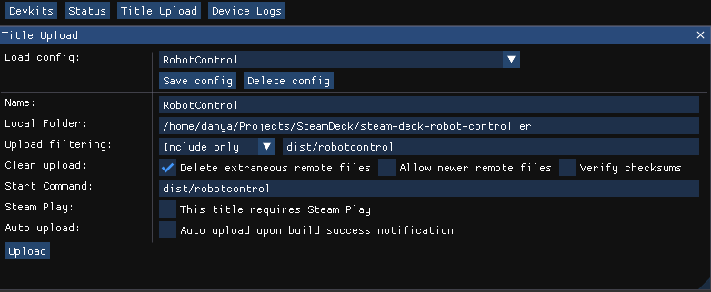

# steam-deck-robot-controller
Use a Steam Deck device to control a mobile robot platform

This app assumes it is being run on a Steam Deck.
Specific assumptions include:

- Screen resolution is fixed at 1280x800
- An XBOX 360 emulated controller, whose axes are as follows:
  - 0,1 -- left joystick
  - 2 -- left trigger (at -1 by default)
  - 3,4 -- right joystick
  - 5 -- right trigger (at -1 by default)

These conditions can be met on other platforms but may require additional configuration.

## Running on Deck

To upload the program, run the `Makefile` to build the program and its dependencies into a single file stored into `dist/robotcontrol`.
Then, use the [SteamOS Devkit tools](https://partner.steamgames.com/doc/steamdeck/loadgames) to upload the program.
Your title upload settings should look like this:

